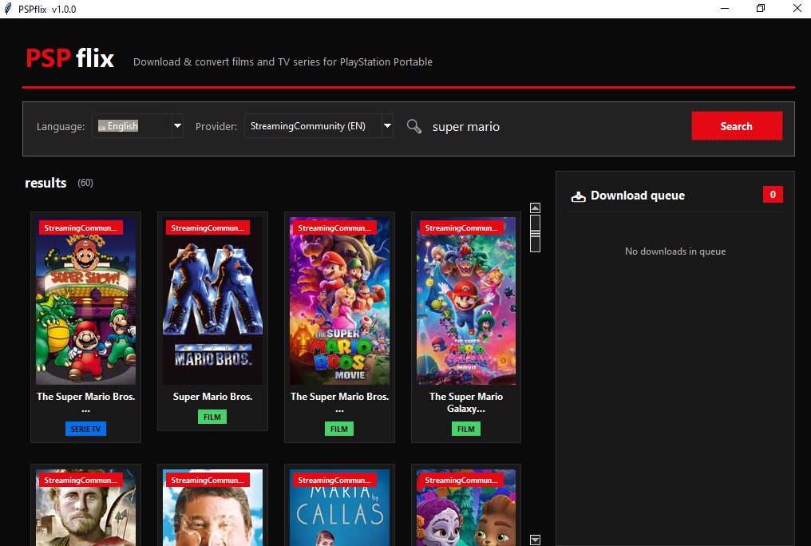
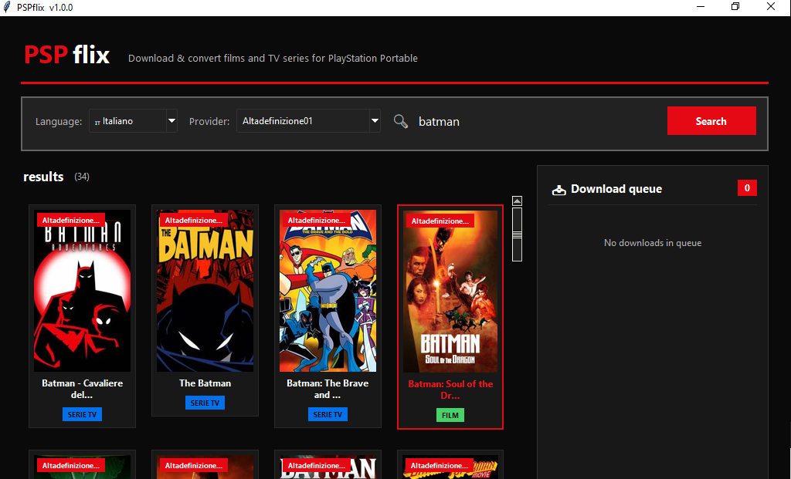
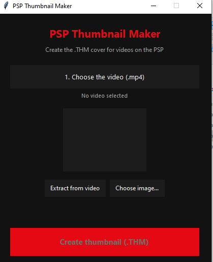

<h1 align="center">PSP Flix</h1>

<p align="center">
  Search films & TV shows, download them and automatically convert them into a
  PSP-compatible MP4.<br>
  <em>Cerca film e serie TV, scaricali e convertili automaticamente in un MP4
  compatibile con la PSP.</em>
</p>

<p align="center">
  
  &nbsp;
  
</p>

---

<!-- =================================================================== -->
<!-- ENGLISH                                                              -->
<!-- =================================================================== -->

## English

### What is PSP Flix?

PSP Flix is a desktop app that lets you search films and TV series from several
streaming providers, download them, and convert them into an MP4 that plays
natively on the Sony PSP. It also ships with a small companion tool,
**PSP Thumbnail Maker**, to generate the `.THM` cover images the PSP shows in
its video menu.

The providers and extractors are ported from the Android app
[StreamflixReborn]([https://github.com/streamflix-reborn/streamflix]).

### ⚠️ Important — some providers may not work

Streaming sites change their layout, domains and anti-bot protections all the
time. Because of this **some providers may stop working at any moment**, and
some CDNs may be blocked by your ISP.

If a provider doesn't work for you:

1. Make sure you are running the latest version.
2. Check whether it is a VPN / region issue (see below).
3. **Open an [issue](https://github.com/SancioPanza88/psp-flix/issues)** describing
   the provider, the title you searched for, and what happened. Please include
   any console output — it makes fixing it much faster.

Currently the most reliable providers are **StreamingCommunity** (IT/EN) and
**AltaDefinizione** (IT). Others are included but may be unstable.

### Requirements

- Python 3.10+
- [`ffmpeg`](https://ffmpeg.org/) (bundled in the release, or install it on your PATH)
- `pip install -r requirements.txt`

### Running

```bash
python pspflix_gui.py
```

Or just download the release and run **`PSP Flix.exe`** (keep
`ffmpeg.exe` in the same folder).

### Using a VPN (to download content)

Some CDN hosts used by these providers can be blocked by your ISP, so a VPN is
often required to download.

If you use the official **ProtonVPN** app (the GUI one, not a separate proxy):

1. Open ProtonVPN and connect to any server.
2. Leave the `"proxy"` field in `psp_config.json` **empty** (`""`).
3. Open PSP Flix normally.

ProtonVPN routes all your PC traffic through the tunnel automatically, so no
proxy configuration is needed. The `"proxy"` field is only for people using a
separate local SOCKS5/HTTP proxy:

```json
{
  "psp_video_dir": "",
  "auto_copy": false,
  "proxy": "socks5://127.0.0.1:1080"
}
```

(SOCKS5 proxies also need `pip install "requests[socks]"`)

> **Tip:** downloads are much faster **without** a VPN. Use one only if a
> provider's CDN is blocked for you.

### Transferring videos to the PSP

1. Connect the PSP to the PC via USB.
2. On the PSP: Settings → USB Connection.
3. Copy the `.mp4` file into `Memory Stick/VIDEO/`.
4. Find the film under Video → Memory Stick.

### PSP Thumbnail Maker (cover images)

The main app does **not** generate PSP cover thumbnails. Use the included
**PSP Thumbnail Maker** (`psp_thumbnail_maker.py` / `PSPThumbnailMaker.exe`).

<p align="center">
  
</p>

Pick the video, extract a frame (click multiple times for other shots) or
choose your own image, and the app creates a `.THM` file next to the video.
Copy the `.mp4` and the `.THM` together into the Memory Stick `VIDEO` folder —
only then does the PSP show the preview instead of the generic white icon.

> The PSP only supports static thumbnails; animated previews (like the PS3) are
> not possible on PSP firmware.

---

<!-- =================================================================== -->
<!-- ITALIANO                                                             -->
<!-- =================================================================== -->

## Italiano

### Cos'è PSP Flix?

PSP Flix è un'app desktop che permette di cercare film e serie TV da vari
provider di streaming, scaricarli e convertirli in un MP4 riproducibile
nativamente sulla Sony PSP. Include anche un piccolo strumento,
**PSP Thumbnail Maker**, per generare le copertine `.THM` che la PSP mostra
nel suo menu video.

I provider e gli extractor sono portati dall'app Android
[StreamflixReborn]([https://github.com/streamflix-reborn/streamflix]).

### ⚠️ Importante — alcuni provider potrebbero non funzionare

I siti di streaming cambiano continuamente layout, domini e protezioni
anti-bot. Per questo motivo **alcuni provider potrebbero smettere di
funzionare in qualsiasi momento**, e alcuni CDN potrebbero essere bloccati
dal tuo ISP.

Se un provider non funziona:

1. Assicurati di usare l'ultima versione.
2. Verifica se è un problema di VPN / regione (vedi sotto).
3. **Apri una [issue](https://github.com/SancioPanza88/psp-flix/issues)**
   indicando il provider, il titolo cercato e cosa è successo. Includi
   l'output della console se puoi — rende molto più veloce la correzione.

Al momento i provider più affidabili sono **StreamingCommunity** (IT/EN) e
**AltaDefinizione** (IT). Gli altri sono inclusi ma potrebbero essere instabili.

### Requisiti

- Python 3.10+
- [`ffmpeg`](https://ffmpeg.org/) (incluso nella release, oppure installalo nel PATH)
- `pip install -r requirements.txt`

### Avvio

```bash
python pspflix_gui.py
```

Oppure scarica la release e avvia **`PSP Flix.exe`** (tieni `ffmpeg.exe`
nella stessa cartella).

### Uso di una VPN (per scaricare i contenuti)

Alcuni host CDN usati da questi provider possono essere bloccati dal tuo ISP,
quindi spesso serve una VPN per scaricare.

Se usi l'app ufficiale di **ProtonVPN** (quella con interfaccia grafica, non un
proxy separato):

1. Apri ProtonVPN e connettiti a un server qualsiasi.
2. Lascia il campo `"proxy"` in `psp_config.json` **vuoto** (`""`).
3. Apri PSP Flix normalmente.

ProtonVPN instrada automaticamente tutto il traffico del PC attraverso il
tunnel, quindi non serve configurare nessun proxy. Il campo `"proxy"` serve
solo a chi usa un proxy SOCKS5/HTTP locale separato:

```json
{
  "psp_video_dir": "",
  "auto_copy": false,
  "proxy": "socks5://127.0.0.1:1080"
}
```

(per i proxy SOCKS5 serve anche `pip install "requests[socks]"`)

> **Consiglio:** i download sono molto più veloci **senza** VPN. Usala solo se
> il CDN di un provider è bloccato per te.

### Trasferire i video sulla PSP

1. Collega la PSP al PC via USB.
2. Sulla PSP: Impostazioni → Connessione USB.
3. Copia il file `.mp4` in `Memory Stick/VIDEO/`.
4. Troverai il film nel menu Video → Memory Stick.

### PSP Thumbnail Maker (copertine)

L'app principale **non** genera le copertine della PSP. Usa lo strumento
incluso **PSP Thumbnail Maker** (`psp_thumbnail_maker.py` /
`PSPThumbnailMaker.exe`).

Scegli il video, estrai un fotogramma (clicca più volte per provarne altri)
oppure scegli un'immagine tua, e l'app crea il file `.THM` accanto al video.
Copia `.mp4` e `.THM` insieme nella cartella `VIDEO` della Memory Stick: solo
così la PSP mostra l'anteprima invece dell'icona bianca generica.

> La PSP supporta solo anteprime statiche; le anteprime animate (come su PS3)
> non sono possibili sul firmware della PSP.

---

## Credits

Providers & extractors ported from
[StreamflixReborn](https://github.com/Stantonwd/StreamflixReborn).
Video conversion powered by [FFmpeg](https://ffmpeg.org/).

## Disclaimer

This project is for educational purposes only. It does not host any content;
it only automates access to publicly available third-party streaming sites.
The user is responsible for how they use it.
